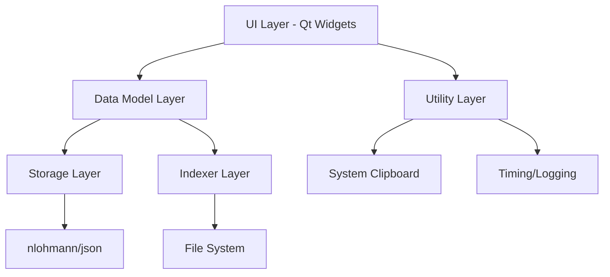

# Design Document

## Overview

The File Indexer is a cross-platform desktop application built with Modern C++20 and Qt 6. It provides efficient file indexing and searching capabilities through a clean, responsive user interface. The application follows a modular architecture with clear separation of concerns across indexing, storage, UI, and utility components.

The core data structure is an in-memory hashmap that maps lowercase filenames to vectors of absolute paths, enabling fast lookups and supporting multiple files with identical names. The application supports both building new indexes through directory scanning and loading previously saved indexes from JSON files.

## Architecture

### High-Level Architecture



### Module Structure

The application is organized into five main namespaces:

- **`indexer`**: Core directory scanning and hashmap building functionality
- **`storage`**: JSON serialization/deserialization with schema validation
- **`model`**: Qt model classes for UI data binding with lazy loading
- **`ui`**: Qt widget classes for user interface components
- **`util`**: Cross-cutting utilities for timing, clipboard, and logging

### Threading Model

**MVP Implementation**: Single-threaded execution on GUI thread for simplicity
- All operations run synchronously to avoid threading complexity
- UI remains responsive through Qt's event loop processing
- Future enhancement: `BuildIndexAsync()` interface prepared for background threading

### Data Flow

1. **Index Building**: User selects directories → Indexer scans recursively → Hashmap populated → Statistics calculated
2. **Index Saving**: Hashmap + metadata → Storage serializes to JSON → File written to disk
3. **Index Loading**: JSON file selected → Storage deserializes and validates → Hashmap populated → UI updated
4. **Search Operations**: User input → Model filters hashmap → UI displays results → Clipboard operations

## Components and Interfaces

### Indexer Component (`indexer` namespace)

**Core Classes:**
- `DirectoryScanner`: Handles recursive directory traversal
- `IndexBuilder`: Manages hashmap construction and statistics
- `ScanResult`: Contains scan results and metadata

**Key Interfaces:**
```cpp
class IndexBuilder {
public:
    struct ScanStats {
        size_t files_total;
        size_t unique_names;
        double build_seconds;
        size_t memory_estimate;
    };
    
    ScanResult BuildIndex(const std::vector<std::string>& root_paths);
    // Future: std::future<ScanResult> BuildIndexAsync(const std::vector<std::string>& root_paths);
};
```

**Responsibilities:**
- Recursive directory traversal using `std::filesystem`
- File path normalization and validation
- Hashmap construction with lowercase filename keys
- Performance metrics collection
- Error handling for inaccessible directories

### Storage Component (`storage` namespace)

**Core Classes:**
- `IndexSerializer`: JSON serialization/deserialization
- `SchemaValidator`: JSON schema validation
- `IndexMetadata`: Metadata container class

**JSON Schema (Version 1):**
```json
{
  "schema_version": 1,
  "roots": ["C:/Users/foo", "..."],
  "files_total": 123,
  "unique_names": 120,
  "build_seconds": 2.34,
  "hashmap": {
    "readme.md": ["C:/proj/readme.md", "..."]
  }
}
```

**Key Interfaces:**
```cpp
class IndexSerializer {
public:
    bool SaveIndex(const std::string& filepath, const IndexData& data);
    std::optional<IndexData> LoadIndex(const std::string& filepath);
    bool ValidateSchema(const nlohmann::json& json);
};
```

### Model Component (`model` namespace)

**Core Classes:**
- `FilenameModel`: Custom `QAbstractListModel` for search results
- `LazyLoader`: Handles incremental result loading
- `FilterEngine`: Manages search filtering logic

**Lazy Loading Strategy:**
- Initial display: First 100 results
- Incremental loading: Additional batches of 100 on scroll/expand
- Memory management: Release unused result batches
- Performance target: Sub-100ms filter response time

**Key Interfaces:**
```cpp
class FilenameModel : public QAbstractListModel {
public:
    void SetIndex(const IndexHashmap& hashmap);
    void SetFilter(const QString& filter);
    void ExpandResults(int additional_count = 100);
    
    // QAbstractListModel overrides
    int rowCount(const QModelIndex& parent = QModelIndex()) const override;
    QVariant data(const QModelIndex& index, int role = Qt::DisplayRole) const override;
};
```

### UI Component (`ui` namespace)

**Core Classes:**
- `MainWindow`: Primary application window
- `StatsDialog`: Index statistics display
- `ToastOverlay`: Temporary notification display

**MainWindow Layout:**
- Menu bar: File operations (Load/Save/New)
- Toolbar: Quick actions and statistics button
- Search box: Real-time filtering input
- Results list: Scrollable file listing with lazy loading
- Status bar: Current operation status and filter timing (debug mode)

**Key Interfaces:**
```cpp
class MainWindow : public QMainWindow {
public:
    void LoadIndex(const QString& filepath);
    void BuildNewIndex(const QStringList& root_directories);
    void ShowStatistics();
    
private slots:
    void OnSearchTextChanged(const QString& text);
    void OnResultClicked(const QModelIndex& index);
};
```

### Utility Component (`util` namespace)

**Core Classes:**
- `Timer`: High-precision timing utilities
- `ClipboardManager`: Cross-platform clipboard operations
- `Logger`: Structured logging with performance metrics

**Key Interfaces:**
```cpp
class Timer {
public:
    void Start();
    double ElapsedSeconds() const;
    static double MeasureOperation(std::function<void()> operation);
};

class ClipboardManager {
public:
    static bool CopyToClipboard(const std::string& text);
    static void ShowCopyNotification(QWidget* parent);
};
```

## Data Models

### Core Data Structures

**IndexHashmap:**
```cpp
using IndexHashmap = std::unordered_map<std::string, std::vector<std::string>>;
// Key: lowercase filename (e.g., "readme.md")
// Value: vector of absolute paths (e.g., ["/home/user/proj1/README.md", "/home/user/proj2/readme.md"])
```

**IndexData:**
```cpp
struct IndexData {
    int schema_version = 1;
    std::vector<std::string> roots;
    size_t files_total;
    size_t unique_names;
    double build_seconds;
    IndexHashmap hashmap;
    
    // Runtime metadata
    double load_seconds = 0.0;
    size_t json_size_bytes = 0;
};
```

**ScanResult:**
```cpp
struct ScanResult {
    IndexHashmap hashmap;
    std::vector<std::string> roots;
    size_t files_total;
    size_t unique_names;
    double build_seconds;
    std::vector<std::string> errors; // Inaccessible paths
};
```

### Memory Management Strategy

- **Smart Pointers**: Use `std::unique_ptr` and `std::shared_ptr`, avoid raw pointers
- **String Optimization**: Use `std::string_view` for read-only operations
- **Container Efficiency**: Reserve vector capacity when size is predictable
- **Large Dataset Handling**: Implement memory monitoring and cleanup for 100k+ files

## Error Handling

### Error Categories

1. **File System Errors**
   - Inaccessible directories during scanning
   - Permission denied on file operations
   - Invalid or non-existent paths

2. **JSON Processing Errors**
   - Malformed JSON files
   - Schema version mismatches
   - Corrupted or incomplete data

3. **UI Operation Errors**
   - Clipboard access failures
   - Memory allocation issues
   - Qt widget initialization problems

### Error Handling Strategy

**Graceful Degradation:**
- Continue scanning when individual directories are inaccessible
- Log errors but maintain application stability
- Provide user feedback for recoverable errors

**Error Reporting:**
```cpp
class ErrorHandler {
public:
    enum class ErrorLevel { Info, Warning, Error, Critical };
    
    static void LogError(ErrorLevel level, const std::string& component, 
                        const std::string& message);
    static void ShowUserError(QWidget* parent, const QString& title, 
                             const QString& message);
};
```

**Validation Strategy:**
- Input validation at UI boundaries
- Schema validation for JSON operations
- Path validation before file system operations
- Memory bounds checking for large datasets

## Testing Strategy

### Unit Testing Framework

**GoogleTest Integration:**
- Test coverage for all core components
- Mock objects for file system operations
- Parameterized tests for cross-platform compatibility

**Test Categories:**

1. **Indexer Tests**
   - Directory scanning accuracy
   - Hashmap construction correctness
   - Performance benchmarks
   - Error handling for inaccessible paths

2. **Storage Tests**
   - JSON serialization round-trip accuracy
   - Schema validation edge cases
   - File I/O error handling
   - Version compatibility

3. **Model Tests**
   - Filtering algorithm correctness
   - Lazy loading behavior
   - Memory usage patterns
   - UI data binding

4. **Integration Tests**
   - End-to-end workflow validation
   - Cross-platform file path handling
   - Large dataset performance

### Performance Testing

**Google Benchmark Integration:**
- Scan throughput measurement (files/second)
- Search filter response time
- Memory usage profiling
- JSON serialization performance

**Performance Targets:**
- Directory scanning: >1000 files/second
- Search filtering: <100ms response time
- Memory usage: <1GB for 100k files
- JSON operations: <5 seconds for 100k files

### Test Data Strategy

- **Small Dataset**: 100 files across 10 directories
- **Medium Dataset**: 10k files across 100 directories  
- **Large Dataset**: 100k files across 1000 directories
- **Edge Cases**: Empty directories, long paths, special characters
- **Cross-Platform**: Windows, macOS, Linux path formats